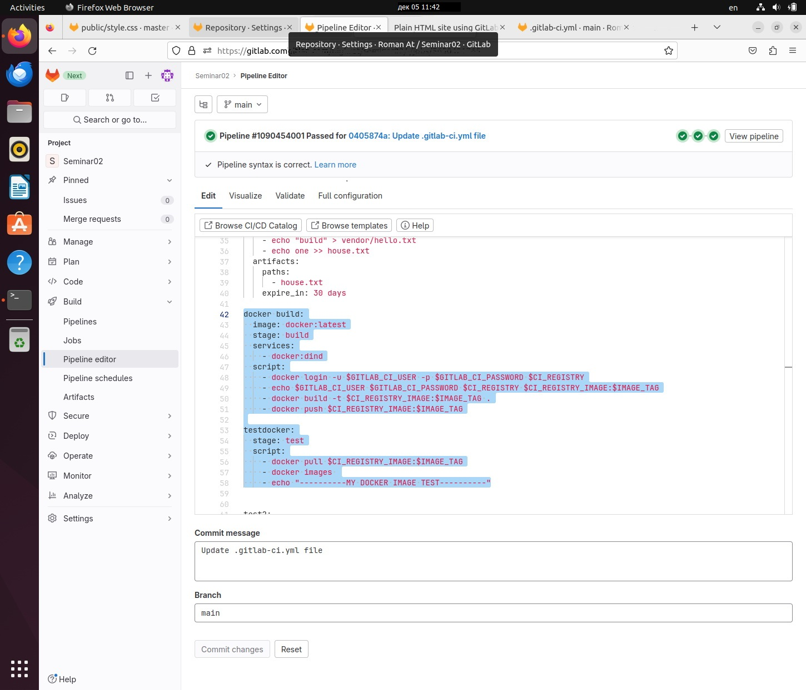
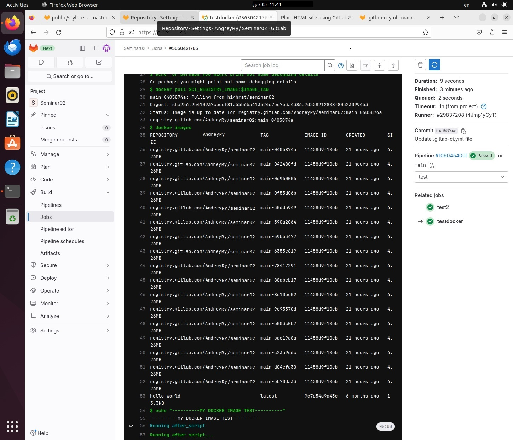
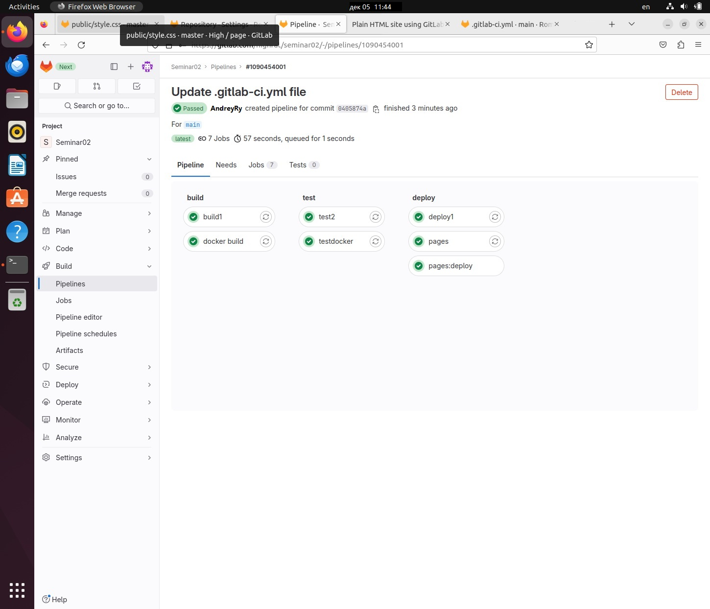

# Процессы CI/CD

## Урок 2. Continuous integration (непрерывная интеграция)

### Задача

Переписать test stage для тестирования docker

Достаточно проверить, что **docker контейнер** нашего собранного образа в предыдущей **job** запускается.

### Решение

Сначала создаем контейнер docker

```yaml
docker build:
  image: docker:latest
  stage: build
  services:
    - docker:dind
  script:
    - docker login -u $GITLAB_CI_USER -p $GITLAB_CI_PASSWORD $CI_REGISTRY
    - echo $GITLAB_CI_USER $GITLAB_CI_PASSWORD $CI_REGISTRY $CI_REGISTRY_IMAGE:$IMAGE_TAG
    - docker build -t $CI_REGISTRY_IMAGE:$IMAGE_TAG .
    - docker push $CI_REGISTRY_IMAGE:$IMAGE_TAG
```

Затем проверяем его загрузку из реестра:

```yaml
testdocker:
stage: test
script: - docker pull $CI_REGISTRY_IMAGE:$IMAGE_TAG - docker images - echo "----------MY DOCKER IMAGE TEST----------"
```

### Скриншоты

Добавляем блок тестирования (протягиваем образ контейнера).


Просматриваем список созданных контейнеров.


Pipeline пройден


## Замечание

Во время создания образа (раздел `docker build:`) — появлялась проблема нехватки прав.

`Got permission denied while trying to connect to the Docker daemon socket at… `

Исправляется добавлением gitlab-runner в группу docker.

```

usermod -aG docker gitlab-runner

```

```

```
