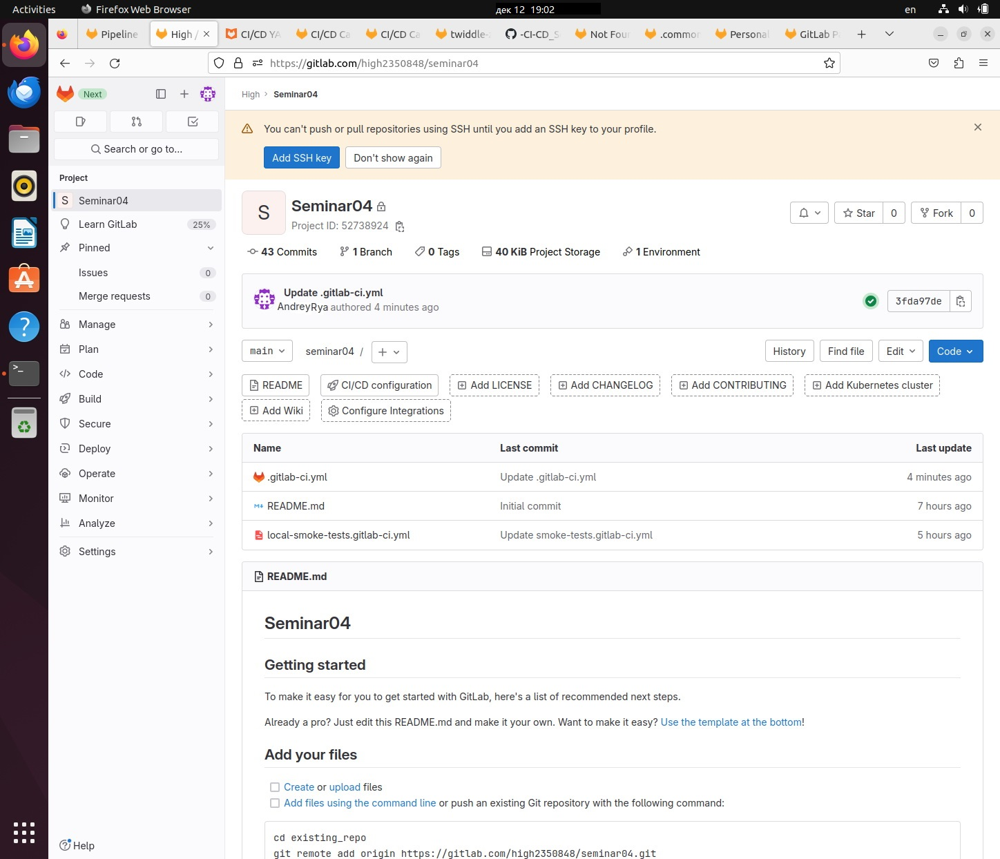
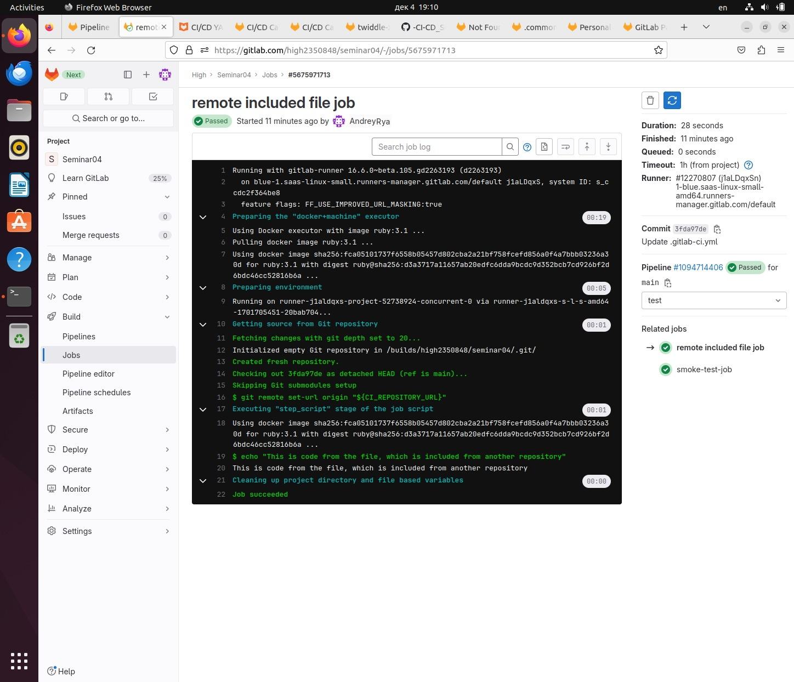
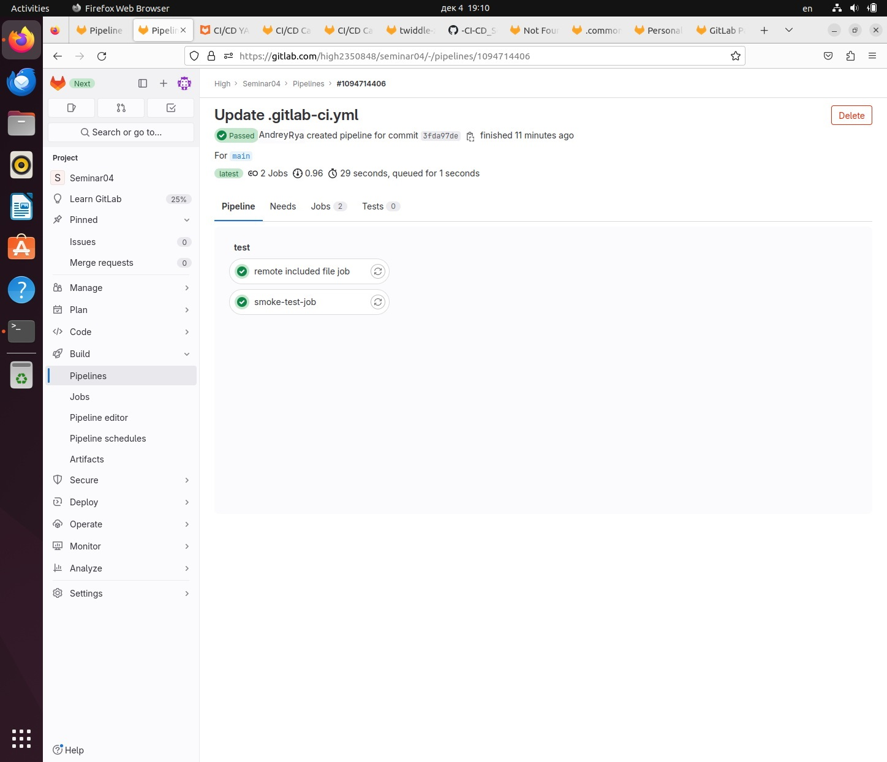

# Процессы CI/CD

## Урок 4. Troubleshooting (диагностика и решение проблем в CI/CD)

### Задача

Сделать локальный шаблон CI и отдельный репозиторий с шаблонами, подключить их к своему основному репозиторию через include

#### Решение

Создан локальный файл `local-smoke-tests.gitlab-ci.yml`

```yaml
smoke-test-job:
  script: echo "SMOKE"
```

Создан основной файл `.gitlab-ci.yml`

```yaml
include:
  - local: local-smoke-tests.gitlab-ci.yml
  #  - remote: https://github.com/Valinetsky/-CI-CD_Seminar04/blob/main/remote-included-file.yml
  # К сожалению, ни собственные файлы в моих репозиториях, ни ссылка на гитхаб не сработали,
  # поэтому взял ссылку у Макса Бобкова:
  - remote: https://gitlab.com/ci-cd7655047/5/-/raw/main/remote-included-file.yml
```

Файл с аналогичным содержанием, что и у Максима, есть в этом репозитории: `remote_included-file.yml`

Репозиторий семинара №4


Удаленное задание с включенным файлом


Pipeline пройден


## Благодарность

Отдельное спасибо Максу Бобкову, без его кода pipeline не хотел работать. Ссылка на гитхаб [здесь](https://github.com/biramax/ "https://github.com/biramax/").
